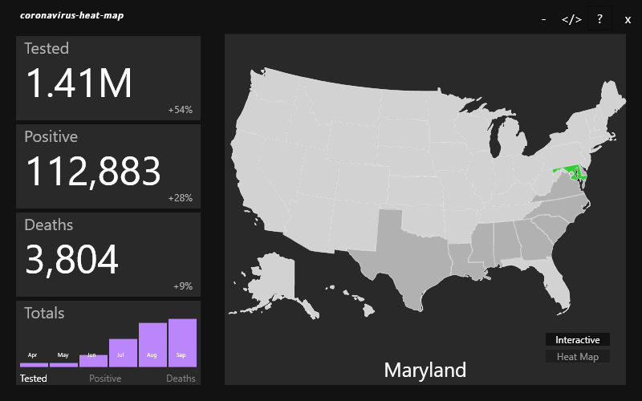

###### Windows Only

# Table of Contents

* [What?](#what)
* [Features](#cool)
* [Install](#install)
* [Concluding Thoughts](#thoughts)

## coronavirus-heat-map <a name="what"></a>
<figure>
  
</figure>

<figure>
  
</figure>

<figure>
  
</figure>

## Features <a name="cool"></a>
* Total tested, positive, and deaths for each states
* Interactive map where you can select your state
* Heat map
* Graph displaying statisical totals from the previous six months

## Installation <a name="install"></a>
1. visit https://drive.google.com/file/d/10aEt1DqdfudY6pT64NO-YPxfZauiQCSX/view?usp=sharing
2. Download **COVID_HEAT_MAP.zip**, then unzip
3. Double-Click **setup.exe** (Windows may block installation, select "More info", then "Run Anyway").
4. A window will appear, select "Install"
5. Enjoy!

## Concluding Thoughts<a name="thoughts"></a>
```
[CORONAVIRUS-HEAT-MAP]

I avoided using the MVVM-Framework because I figured it would be sort of overkill for what I consider a 
pretty straight-forward application.

So, instead its broken into two main C# files
  * StateData.cs
    * Fetches data for each state
    * Performs ~some~ functions for the data collected (probably shouldve split it up for clarity, 
      but I'll do that in the future)
  * MainWindow.xaml.cs
    * Manages UI
    * Evaluates and performs ~most~ functions for the data collected
    * communicates with the XAML tags </>

Future Goals
  * How can I make this code easy to follow to the extent that someone could read, 
    understand, and build upon it.

NOTE
  * I use the word "state" alot here. Sometimes to refer to actual states (Maryland, New York, etc) 
    and other times to refer to the state of the UI (heat map or interactive map). 
    I hope context-clues negate any semantic ambiguity.
```
